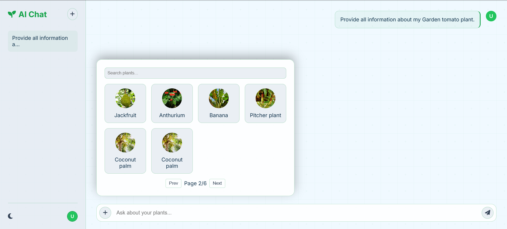

# 🌱 Smart Plant Management System

## 📌 Project Description
The **Smart Plant Management System** is an IoT and AI-powered platform designed to help gardeners and farmers monitor plant health.  
It integrates **ESP32 sensors and camera**, a **Spring Boot backend**, and a **Python machine learning model** for disease detection.  
The system also uses **Ollama AI** to generate natural language insights and provides a **community learning forum** for knowledge sharing.

**Key Features:**
- User registration and login (Gardener / Expert roles)
- Plant registration with image recognition (Plant.ID API) and location mapping
- Real-time monitoring of weather and IoT sensor data (ESP32-CAM, DHT22, soil moisture sensor)
- Inline disease detection from IoT camera images
- Standalone diagnosis page for direct image upload and AI insights
- AI Assistant for plant-related queries
- Learning forum with posts, comments, upvotes, and downvotes
- Expert and Analytics pages (under development)

---

## 📸 Screenshots

- **Home / Login & Registration**  
  

- **Plant Registration**  
  

- **Monitor Dashboard**  
  

- **Disease Check**  
  

- **Diagnosis Page**  
  

- **AI Assistant**  
  

- **Learning Forum**  
  

---

## ⚙️ Setup Instructions

### 1. Prerequisites
- **Java 17+** and **Maven/Gradle**
- **MySQL** database
- **PHP 7.x** with Apache/Nginx (for ESP32 integration)
- **Arduino IDE** (for ESP32 firmware)
- **Python 3.8+** with `pip`
- ESP32-CAM, DHT22, and soil moisture sensor hardware

---

### 2. Backend (Spring Boot)

1. Clone the repository:
   ```bash
   git clone https://github.com/your-username/smart-plant-management.git
   cd smart-plant-management/backend

2. Configure src/main/resources/application.properties:
   ```bash
   spring.datasource.url=jdbc:mysql://localhost:3306/smartfarm
   spring.datasource.username=YOUR_DB_USER
   spring.datasource.password=YOUR_DB_PASS
   diagnosis.upload-dir=uploads/diagnoses
   python.predict-url=http://localhost:5000/predict
   ai.model.answer=mistral-7b-instruct
   jwt.secret=YOUR_SECRET_KEY

3. Build and run:
   ```bash
   ./mvnw clean install
   ./mvnw spring-boot:run

4. API available at:
   ```bash
   http://localhost:8080

---

### 3. Frontend (HTML/CSS/JS)

1. Navigate to the frontend folder:
   ```bash
   cd smart-plant-management/frontend

2. Serve files with a static server:
   ```bash
   npx http-server
  Or open auth.html directly in your browser.

---

### 4. Python Model (Disease Detection)

1. Navigate to the Python model folder:
   ```bash
   cd smart-plant-management/python-model
   
2. Setup environment:
   ```bash
   python3 -m venv venv
   source venv/bin/activate
   pip install -r requirements.txt

3. Run the service:
   ```bash
   uvicorn app:app --host 0.0.0.0 --port 5000

4. Endpoint:
   ```bash
   http://localhost:5000/predict

---

**IoT Device Setup (ESP32-CAM + Sensors)**
- Open the Arduino sketch (esp32-cam-firmware.ino) in Arduino IDE.
- Update Wi-Fi credentials and backend URL.
- Upload to ESP32-CAM.
- Connect DHT22 and soil moisture sensors.
- Deploy esp32-receiver.php to your PHP server.
- Verify sensor data posts to http://localhost:8080/api/sensor-data

---

## 🎥 Demo Video

Watch the full demo on YouTube:  
👉 [**SmartPlantSystem_Demo_2025**](https://youtu.be/TVU--w5mgs8)

---

## 📖 License

Copyright © 2025 [Chamith Bhanuka]

This project is provided for **common usage, learning, and demonstration purposes**.  
You are welcome to explore the code, run it locally, and adapt it for your own non‑commercial projects. 


