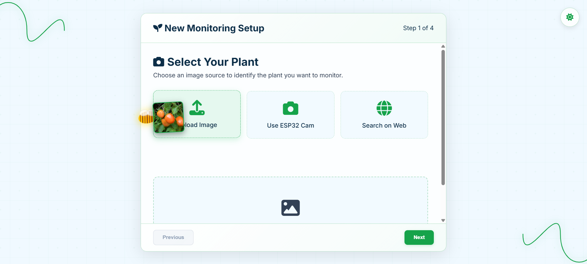

# 🌱 Smart Plant Management System

## 📌 Project Description
The **Smart Plant Management System** is an IoT and AI-powered platform designed to help gardeners and farmers monitor plant health.  
It integrates **ESP32 sensors and camera**, a **Spring Boot backend**, and a **Python machine learning model** for disease detection.  
The system also uses **Ollama AI** to generate natural language insights and provides a **community learning forum** for knowledge sharing.

**Key Features:**
- User registration and login (Gardener / Expert roles)
- Plant registration with image recognition (Plant.ID API) and location mapping
- Real-time monitoring of weather and IoT sensor data (ESP32-CAM, DHT22, soil moisture sensor)
- Inline disease detection from IoT camera images
- Standalone diagnosis page for direct image upload and AI insights
- AI Assistant for plant-related queries
- Learning forum with posts, comments, upvotes, and downvotes
- Expert and Analytics pages (under development)

---

## 📸 Screenshots

> Replace these placeholders with actual screenshots from your project.

- **Home / Login & Registration**  
  

- **Plant Registration**  
  

- **Monitor Dashboard**  
  

- **Disease Check**  
  

- **Diagnosis Page**  
  

- **AI Assistant**  
  

- **Learning Forum**  
  

---

## ⚙️ Setup Instructions

### 1. Prerequisites
- **Java 17+** and **Maven/Gradle**
- **MySQL** database
- **PHP 7.x** with Apache/Nginx (for ESP32 integration)
- **Arduino IDE** (for ESP32 firmware)
- **Python 3.8+** with `pip`
- ESP32-CAM, DHT22, and soil moisture sensor hardware

---

### 2. Backend (Spring Boot)

1. Clone the repository:
   ```bash
   git clone https://github.com/your-username/smart-plant-management.git
   cd smart-plant-management/backend

### 2. Backend (Spring Boot)

1. Clone the repository:
   ```bash
   git clone https://github.com/your-username/smart-plant-management.git
   cd smart-plant-management/backend
